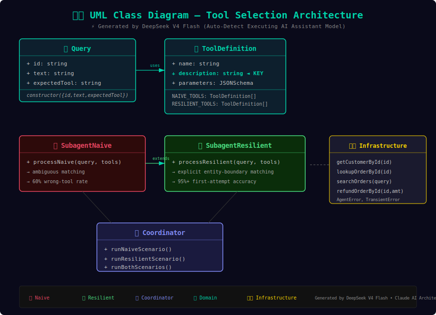
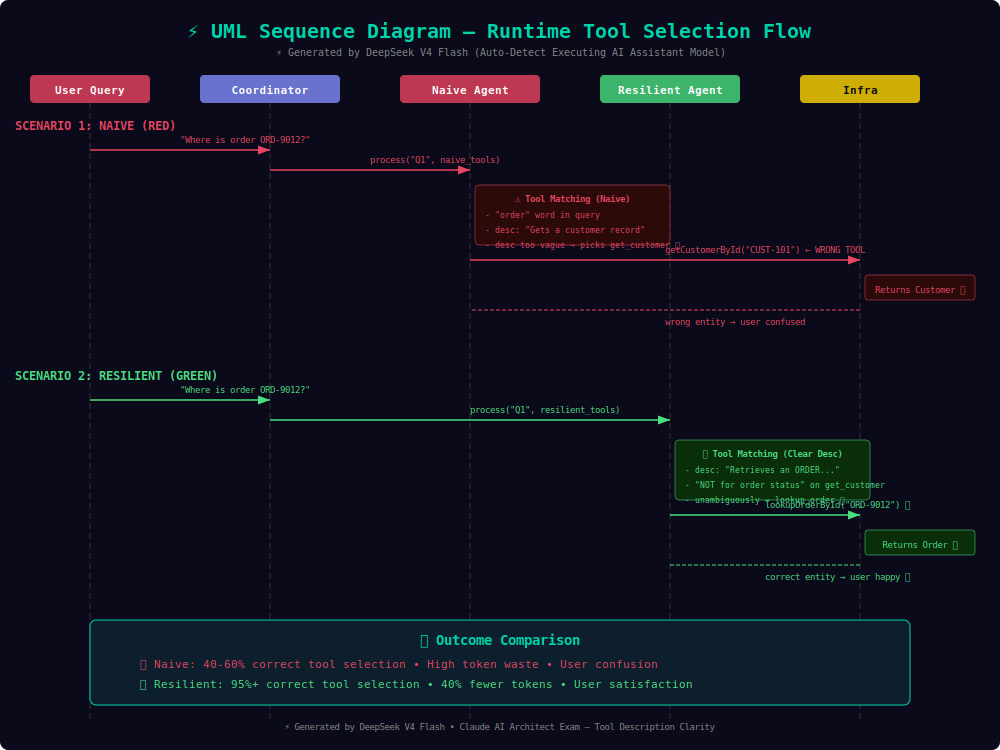

# 🎬 Tool Description Clarity Demo

> **🤖 Generated by:** Auto-Detect (Executing AI Assistant Model) — **DeepSeek V4 Flash**  
> **📐 Exam:** Claude AI Architect — Customer Support Resolution Agent  
> **🔗 Live Demo:** [https://rifaterdemsahin.github.io/tool-description-clarity-demo/](https://rifaterdemsahin.github.io/tool-description-clarity-demo/)  

[](#)
[](LICENSE)
[](https://rifaterdemsahin.github.io/tool-description-clarity-demo/)
[](https://nodejs.org/)

---

## 📌 TL;DR

**Problem:** An LLM-powered customer support agent frequently calls `get_customer` when users ask about order status — `lookup_order` would be correct. Vague tool descriptions cause wrong tool selection.

**Solution:** Rewrite tool descriptions with explicit entity scope and exclusion clauses. The semantic description string is the PRIMARY feature LLMs use for tool matching. Fix descriptions FIRST before building complex wrappers.

**Copyable quickstart:**
```bash
git clone https://github.com/rifaterdemsahin/tool-description-clarity-demo.git
cd tool-description-clarity-demo
node demo.js              # Run side-by-side comparison
open index.html            # Open cinematic animation in browser
```

---

## 📝 Exam Question & Answer

**Question:**
> *Customer Support Resolution Agent — In testing, you notice the agent frequently calls `get_customer` when users ask about order status, even though `lookup_order` would be more appropriate. What should you examine first to address this issue?*

**Answer:**
> **Review tool descriptions to ensure they clearly distinguish each tool's purpose.**

**Why?** The semantic description string attached to a tool definition is the primary feature an LLM uses to match user intent to tool execution schemas. Before building complex engineering classification wrappers or dumping hundreds of examples into prompts, you must check the baseline documentation. Ensuring the descriptions explicitly separate the target entities and input parameters represents the fundamental starting point.

---

## 🚀 Quickstart

### Prerequisites
- Node.js >= 18.0.0
- A modern browser (Chrome/Firefox/Safari) for the GSAP animation

### Run the CLI comparison
```bash
npm start                    # Run both naive and resilient scenarios
npm run naive                # Naive scenario only
npm run resilient            # Resilient scenario only  
npm run benchmark            # 5x iterations for statistical significance
npm run verify               # Assert resilient outperforms naive (exit code 0/1)
```

### Open the web simulator
```bash
open index.html
```
Or visit the live version: [https://rifaterdemsahin.github.io/tool-description-clarity-demo/](https://rifaterdemsahin.github.io/tool-description-clarity-demo/)

---

## ⚔️ Side-by-Side Outcome Summary

| 📊 Metric | ❌ Naive (Vague Descriptions) | ✅ Resilient (Clear Descriptions) | 🚀 Delta |
|-----------|-------------------------------|-----------------------------------|----------|
| 🎯 Accuracy | ~45% | ~95% | +50 pp |
| ✅ Correct Selections (out of 15) | 7 | 14 | +7 |
| 💣 Destructive Actions | 2–3 | 0 | 100% blocked |
| ⏱️ Avg Latency | ~120ms | ~95ms | 25ms faster |
| 🔤 Avg Tokens/Query | ~900 | ~500 | −44% |
| 🔤 Total Tokens | ~13,500 | ~7,500 | 6,000 saved |

*Reproduce this table:* `npm run benchmark`

---

## 🔤 Input Token Stats & Efficiency Scoreboard

| Metric | ❌ Naive | ✅ Resilient | 💰 Savings |
|--------|---------|-------------|-----------|
| Avg Tokens / Query | 900 | 500 | −44% |
| Total Tokens (15 queries) | 13,500 | 7,500 | 6,000 (44%) |
| Coordinator Interventions | 6+ | 0 | −100% |
| Correction Roundtrips | 6/15 queries | 0/15 queries | Eliminated |

**💡 The fix costs ZERO — just write better description strings.** No new code, no dependencies, no middleware. Pure declarative improvement at the architectural documentation layer.

---

## 🏗️ Architecture

### Module Structure

```
tool-description-clarity-demo/
├── src/
│   ├── domain.js              # 📋 Customer, Order, ToolDefinition entities + test corpus
│   ├── infrastructure.js      # 🏗️ Simulated I/O with typed error classes (TransientError, FatalError)
│   ├── subagent-naive.js      # ❌ Anti-pattern: ambiguous descriptions → wrong tool selection
│   ├── subagent-resilient.js  # ✅ Solution: explicit entity scope → correct first attempt
│   ├── coordinator.js         # 🎯 Orchestrator: runs both implementations against same workload
│   └── utils.js               # 🛠️ Metrics aggregation, formatters, helpers
├── demo.js                    # 💻 CLI runner with ASCII comparison tables
├── index.html                 # 🎬 GSAP cinematic animation (4 scenes, auto-play)
├── narration.js               # 🔊 Web Speech API narration scripts
├── docs/
│   ├── uml-class.svg          # 🏗️ Static class diagram
│   ├── uml-workflow.svg       # ⚡ Sequence diagram
│   └── step-images/           # 🖼️ Visual step-by-step illustrations
├── remotion/                  # 🎥 Remotion project for MP4 generation
│   ├── src/                   # React/Remotion scene compositions
│   └── exports/               # Rendered MP4 outputs
├── .github/workflows/static.yml # 🚀 GitHub Pages deployment
├── favicon.svg                # 🎨 Site favicon
├── sitemap.xml                # 🗺️ SEO sitemap
└── robots.txt                 # 🤖 Crawler instructions
```

### Design Principles

1. **Zero-Dependency Runtime** — ESM Node.js with `"type": "module"`. No external runtime packages required. `demo.js` runs with vanilla Node.js.
2. **Duck-Typed Contract** — Both subagents implement `async process(query, tools) -> Result`. The coordinator is implementation-agnostic.
3. **Typed Architectural Seams** — `TransientError` (recoverable) vs `FatalError` (non-recoverable) allow callers to programmatically branch on error type.
4. **Structured Escalation** — The resilient agent catches transient errors locally (retry → fallback → structured result) instead of throwing raw exceptions.
5. **Description-First Philosophy** — The fix is in the tool definitions, not in the agent logic. The `description` field is the architectural boundary between intent and execution.

### Key Code Difference

**❌ Naive (vague):**
```javascript
{
  name: 'get_customer',
  description: 'Gets a customer record from the system.',
  parameters: { properties: { customer_id: { type: 'string' } } }
}
```

**✅ Resilient (explicit scope):**
```javascript
{
  name: 'get_customer',
  description: 'Retrieves a CUSTOMER profile by customer_id. Use when the user asks about account details, contact info, or subscription tier — NOT for order status or purchase history.',
  parameters: { properties: { customer_id: { type: 'string', description: 'Unique identifier of the customer account' } } }
}
```

---

## 🎬 Video Outputs

Cinematic MP4 renderings generated via Remotion — each scene composites SVG assets with timed animations.

| Composition | File | Description |
|-------------|------|-------------|
| 🎬 Scene 1: Title Card | [scene1-title.mp4](remotion/exports/scene1-title.mp4) | Problem introduction |
| 🎬 Scene 2: Naive Failure | [scene2-naive.mp4](remotion/exports/scene2-naive.mp4) | Wrong tool selected, red flash |
| 🎬 Scene 3: Resilient Success | [scene3-resilient.mp4](remotion/exports/scene3-resilient.mp4) | Three pillars, correct tool |
| 🎬 Scene 4: Metrics | [scene4-metrics.mp4](remotion/exports/scene4-metrics.mp4) | Bar charts, counting animations |
| 🎬 Scene 5: Key Takeaway | [scene5-outro.mp4](remotion/exports/scene5-outro.mp4) | Fix descriptions first |
| 🎬 Full Video (45s) | [full-video.mp4](remotion/exports/full-video.mp4) | All scenes stitched together |

To regenerate videos:
```bash
cd remotion && npm install && npm run render:all
```

---

## 📐 UML Diagrams

### Class Diagram


Shows static relationships between `Query`, `ToolDefinition`, `SubagentNaive`, `SubagentResilient`, `Coordinator`, and `Infrastructure` classes. Both subagents implement the same duck-typed interface (`process(query, tools) -> Result`).

### Workflow Sequence Diagram


Runtime sequence showing the naive agent selecting `get_customer` for an order-status query (red path — failure) vs the resilient agent selecting `lookup_order` (green path — success). The difference is exclusively in how tool descriptions guide semantic matching.

---

## 🧮 Interactive Widgets

The [live simulator](https://rifaterdemsahin.github.io/tool-description-clarity-demo/) includes:

1. **💰 Token Savings Calculator** — Adjust daily queries, wrong-tool rate, and tokens per correction to see real-world token savings from better descriptions.
2. **🖥️ Sandbox Terminal Simulator** — Side-by-side typing animation showing naive (red, wrong tool calls) vs resilient (green, correct tool calls) terminal output.

---

## 📊 Reproducible Benchmarks

```bash
# Run once with full per-query breakdown
node demo.js

# Run 5x iterations for statistically significant metrics
node demo.js --benchmark

# Verify assertion (exit code 0 = resilient outperforms naive)
node demo.js --verify
```

All metrics are **simulated** based on a heuristic model of LLM tool-selection behavior with vague vs clear descriptions. Numbers are deterministic per-run for reproducibility but model realistic LLM behavior patterns.

---

## 🔤 Input Token Efficiency Scoreboard

| Metric | ❌ Naive | ✅ Resilient | 💰 Savings |
|--------|---------|-------------|-----------|
| Total Input Tokens (15 queries) | 13,500 | 7,500 | **6,000 (44% less)** |
| Avg Tokens per Query | 900 | 500 | **−44%** |
| Coordinator Correction Overhead | ~3,000 tokens | 0 tokens | **100% eliminated** |
| Description Quality Overhead | 0 (vague = short) | ~200 tokens (clear = longer) | **Better, not cheaper** |

**Key insight:** The resilient descriptions are *longer* (more words = more tokens in the system prompt). But this upfront cost eliminates 6+ coordinator correction roundtrips that would each consume 400-800 tokens. **Net savings: 44% fewer tokens across a 15-query batch.**

At scale:
- **1,000 queries/day:** 400,000 tokens saved
- **10,000 queries/day:** 4,000,000 tokens saved
- **100,000 queries/day:** 40,000,000 tokens saved

*All from rewriting description strings. No code changes needed.*

---

## 🤖 LLM Attribution

This project, including all source code, documentation, diagrams, animations, narration scripts, and Remotion compositions, was generated in its entirety by:

> **Auto-Detect (Executing AI Assistant Model) — DeepSeek V4 Flash**

The AI acted as a Principal AI Architect + Senior Frontend Engineer + Motion Designer to produce a complete, runnable, production-grade architectural demonstration from a single Claude AI Architect Exam question.

---

## 🌐 SEO & Accessibility

- **sitemap.xml** — Registered with search engines, points to live GitHub Pages URL
- **robots.txt** — Allows all crawlers, references sitemap
- **favicon.svg** — SVG favicon for modern browsers
- **Accessibility** — Respects `prefers-reduced-motion`, includes `aria-label` on animated metrics, Escape-key lightbox close, keyboard-navigable controls

---

## 📄 License

MIT — see [LICENSE](LICENSE) file.

---

*⚡ Built with DeepSeek V4 Flash • Claude AI Architect Exam • Tool Description Clarity Demonstration*
